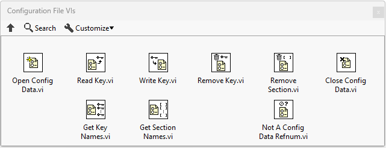
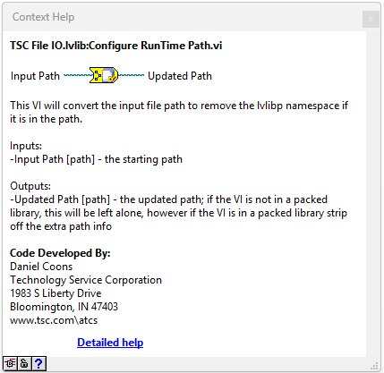

# tsc-file-io
This library puts a wrapper around the native LabVIEW Config File VIs but handles stripping lvlibp namespaces.

Find the VIP here:  

Configuration files have a specific format, but can have any type of file extension. Some example file extensions could be `*.ini`, `*.txt`, `*.cfg`, etc.

*Why have configuration files?* They give your programs the ability to dynamically read/write/use parameters without recompiling a program. Basically, it adds flexiblity.

A configuration file has a specific format that looks like this:

     [Section]
     Key = Value

Where keys are grouped into like sections and are connected to a value of some data type (numeric, string, Boolean, and path typically). In LabVIEW the Configuration File VIs palette can be used to access these key/value pairs by referencing the Section name, Key name, and some connection to data type.

## Why Reinvent the Wheel?
To build plugin-based LabVIEW architectures, we use a concept called a `Packed Project Library` in LabVIEW; it is a compiled version of a LabVIEW library and an executable can use them dynamically.

When libraries are compiled they add their own namespace to the functions contained in the library and if you are using certain path components to build a relative path to a file, that can cause a problem.

### Example
     [Settings]
     Greeting = Hello World

#### Development Environment
We are building a RELATIVE path to the `text.ini` file by using the `Current VI's Path`, stripping off its `main.vi` part and referencing the file.

**Note**: the qualified name of this function is `PPL Library.lvlib:main.vi`

#### Compiled Version

Notice the code here is fairly similar when compiled; I **can't** edit it, but I built it with `Debug` enabled so I can see it.

**Note**: now the qualified name of this function is `PPL Library.lvlibp:main.vi`

**But...** my result has an error and I don't get the correct `Greeting`. The error says that the `file doesn't exist` and if you look at the Path to File indicator the lvlibp portion of the qualified name is now in the path.

## How do we fix it?!?!?!
You can strip out that portion of the path and handle it wherever you are referencing files this way...**OR** use the `TSC File IO` functions.

Here is the updated code using the `TSC File IO` library.

`Read Section - String.v`i is a function that will open/read/close the file reference and handle PPL qualified name challenges.

### Development Environment

### Compiled Version

### IT'S A MATCH!

The versatility here gives the ability to reference files from locations that will have the ppl namespace added to the path but we won't have to come up with all kinds of logic to determine if we need to pull it out or not.

If you aren't using `ini`-type files for configuration and just need the assitance with the path, use the `Configure RunTime Path.vi` function to clear that PPL namespace out of the path.

